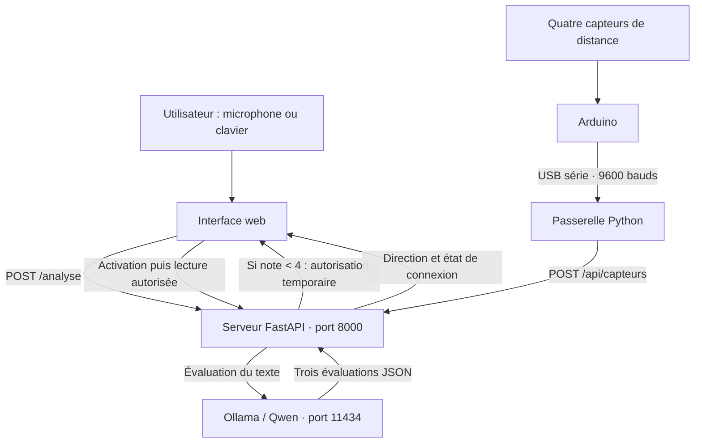

# Warp Gate Detector

**Une expérience interactive qui associe humour, intelligence artificielle locale et détection d’obstacles avec Arduino.**

Développé dans le cadre du Workshop B2, Warp Gate Detector propose de retrouver un portail dans une interface inspirée de l’univers de Rick & Morty. Pour accéder au radar, l’utilisateur doit d’abord raconter ou écrire une blague que le modèle juge suffisamment nulle.

Le projet relie une interface web, un serveur FastAPI, un modèle Qwen exécuté avec Ollama et quatre capteurs de distance connectés à une carte Arduino. Le portail affiché représente la direction de l’obstacle détecté : les capteurs mesurent des distances, et l’interface les transforme en élément de jeu.

## Sommaire

- [Fonctionnement](#fonctionnement)
- [Architecture](#architecture)
- [Organisation du projet](#organisation-du-projet)
- [Prérequis](#prérequis)
- [Installation](#installation)
- [Montage Arduino](#montage-arduino)
- [Démarrage et utilisation](#démarrage-et-utilisation)
- [Configuration](#configuration)
- [API](#api)
- [Tests et vérifications](#tests-et-vérifications)
- [Dépannage](#dépannage)
- [Périmètre et limites](#périmètre-et-limites)

## Fonctionnement

### Parcours utilisateur

1. Cliquer sur **Commencer**.
2. Raconter une blague au microphone, puis recliquer pour terminer, ou utiliser **Écrire la blague au clavier**.
3. Attendre l’analyse du modèle. L’écran affiche le texte reçu et le temps écoulé.
4. Si la note est **strictement inférieure à 4/10**, la recherche du portail démarre automatiquement.
5. Déplacer le détecteur ou un obstacle devant les capteurs. Le radar indique la direction détectée et continue de suivre les mesures.
6. Cliquer sur **Arrêter et recommencer** pour terminer la recherche et revenir à l’accueil.

Une blague notée 4/10 ou plus conduit à l’écran **Réessayer**. La saisie accepte de 1 à 5 000 caractères après suppression des espaces en début et en fin.

### Évaluation de la blague

Une seule requête est envoyée au modèle configuré, actuellement **`qwen3:4b-instruct`**. Il produit trois évaluations dans une réponse JSON :

| Point de vue | Critères principaux |
| --- | --- |
| Stand-up | Construction, rythme et efficacité de la chute |
| Absurde | Incongruité, décalage et rupture de logique |
| Public français | Compréhension et potentiel comique auprès d’un public généraliste |

Chaque évaluation contient une note, des critères détaillés, un niveau de confiance et une courte justification. La note finale est la **médiane des trois notes**. La confiance globale correspond à la moyenne des confiances, ramenée sur une échelle de 0 à 1.

| Note finale | Verdict | Accès à la recherche |
| --- | --- | --- |
| Moins de 4 | Pas drôle | Autorisé |
| De 4 à moins de 7 | Moyennement drôle | Refusé |
| De 7 à 10 | Drôle | Refusé |

Le prompt actuel de [`app/evaluator.py`](site/app/evaluator.py) comporte aussi deux consignes de démonstration : « Qu’est-ce qui est jaune et qui attend ? Jonathan. » doit être jugée assez nulle, tandis que « Le comble pour un électricien ? De ne pas être au courant. » doit être refusée. Ces résultats sont demandés au modèle ; ils ne sont pas imposés par une condition Python et restent dépendants de sa réponse.

### Conditions d’accès aux directions

Le serveur exige deux conditions avant de transmettre une direction au navigateur :

- une autorisation issue d’une blague validée par le LLM ;
- une recherche explicitement activée avec cette autorisation.

L’autorisation est propre à chaque tentative et expire après **15 minutes à compter de sa création**. Le bouton d’arrêt la révoque. Lorsqu’une nouvelle analyse fournit l’ancienne autorisation, celle-ci est également révoquée, même si l’analyse échoue.

La passerelle Arduino peut alimenter le serveur en continu avant la validation. Le contrôle porte sur la lecture des directions par le navigateur.

## Architecture



| Composant | Technologies | Rôle |
| --- | --- | --- |
| Interface | HTML, CSS, JavaScript natif | Saisie, reconnaissance vocale, navigation et radar |
| Serveur | Python, FastAPI, Uvicorn, Pydantic | Fichiers web, validation des entrées et autorisation de recherche |
| Analyse d’humour | Ollama, Qwen, HTTPX | Inférence locale et agrégation des évaluations |
| Passerelle | Python, pySerial, Requests | Lecture du port série, choix de la direction et transmission HTTP |
| Matériel | Arduino et quatre capteurs à signaux TRIG/ECHO | Mesure des distances nord, sud, est et ouest |
| Tests | unittest et runner intégré de Node.js | Vérification du serveur, de la passerelle et de l’interface |

Le serveur complet est **`server.main:app`**. Il sert l’interface et toutes les routes nécessaires sur la même origine. Aucun serveur frontend, `npm install` ou outil de compilation JavaScript n’est nécessaire.

## Organisation du projet

Ce README se trouve à la racine du dépôt. L’application est regroupée dans le sous-dossier `site/`, qui contient `requirements.txt` et les scripts `.cmd`. Sauf indication contraire, les chemins techniques et les commandes ci-dessous sont relatifs à ce sous-dossier.

```text
Workshop-B2/
├── README.md
├── .gitignore
└── site/
    ├── requirements.txt
    ├── installer.cmd
    ├── demarrer-site.cmd
    ├── demarrer-capteurs.cmd
    ├── app/
    │   ├── main.py                  # Routes de l’API d’analyse
    │   ├── evaluator.py             # Prompt et calcul du verdict
    │   ├── models.py                # Schémas de validation
    │   └── ollama.py                # Client Ollama et choix du modèle
    ├── server/
    │   └── main.py                 # Serveur complet et autorisations
    ├── arduino/
    │   ├── main.py                 # Passerelle série vers HTTP
    │   └── code_arduino/
    │       └── code_arduino.ino     # Programme à téléverser sur la carte
    ├── site/
    │   ├── index.html
    │   ├── css/style.css
    │   └── src/
    │       ├── script.js
    │       └── images/
    └── tests/
        ├── test_backend.py
        ├── test_capteurs.py
        └── script.test.cjs
```

`installer.cmd` crée un environnement Python `.venv/` dans le dossier de l’application. L’ancien environnement `arduino/venv/` et les fichiers `index_old.html` / `style_old.css` ne font pas partie du lancement courant.

Le dossier de travail parent `Workshop B2` conserve, hors de ce dépôt, les étapes exploratoires du projet : transcription avec Wav2Vec2 (`main.py`), Faster-Whisper et Silero VAD (`test.py`), Parakeet (`record.py`, `test2.py`), classification avec llama.cpp (`micro.py`), ainsi qu’une ancienne interface dans `Workshop finale/` et des archives ZIP. Ces prototypes documentent les expérimentations ; ils ne sont pas appelés par l’application actuelle. Leur fichier `requirement.txt` est distinct du `requirements.txt` utilisé ici.

## Prérequis

- **Windows et Python 3.11** pour la procédure fournie ; la commande `python` doit être disponible dans le terminal.
- **Ollama**, avec le modèle indiqué dans [`app/ollama.py`](site/app/ollama.py).
- Un navigateur permettant l’exécution de JavaScript. Le microphone nécessite la prise en charge de `SpeechRecognition` ou `webkitSpeechRecognition` et l’autorisation de l’utilisateur.
- Pour la détection physique : une **Arduino Uno**, son câble USB, quatre capteurs de distance à signaux TRIG/ECHO et le câblage adapté.
- L’IDE Arduino pour téléverser le programme de la carte.
- **Node.js pour les tests JavaScript uniquement** ; la suite a été exécutée avec Node.js 22.

L’installation des dépendances et le téléchargement du modèle nécessitent une connexion Internet. Le temps d’inférence dépend des ressources de l’ordinateur ; l’analyse peut durer plusieurs minutes.

## Installation

### 1. Installer les dépendances Python

Ouvrir un terminal PowerShell à la racine du dépôt, puis entrer dans le dossier de l’application :

```powershell
Set-Location .\site
python --version
.\installer.cmd
```

Le script crée `.venv` et installe les dépendances de `requirements.txt`. Les commandes de lancement utilisent directement cet environnement : son activation manuelle n’est pas nécessaire.

### 2. Préparer Ollama

Démarrer Ollama, puis télécharger le modèle configuré :

```powershell
ollama pull qwen3:4b-instruct
ollama list
```

Le nom doit correspondre exactement à la constante `MODEL` de [`app/ollama.py`](site/app/ollama.py). Le modèle est disponible dans le [catalogue officiel Ollama](https://ollama.com/library/qwen3:4b-instruct).

Si le service Ollama n’est pas déjà démarré par l’application, le lancer dans un terminal séparé :

```powershell
ollama serve
```

L’application contacte Ollama à l’adresse `http://127.0.0.1:11434/api/chat`.

### 3. Préparer la carte

Ouvrir [`code_arduino.ino`](site/arduino/code_arduino/code_arduino.ino) dans l’IDE Arduino, sélectionner la carte et son port, puis téléverser le programme. Fermer ensuite le moniteur série pour libérer le port avant de lancer la passerelle Python.

## Montage Arduino

Le programme définit le brochage suivant :

| Direction | Broche TRIG | Broche ECHO |
| --- | --- | --- |
| Nord | D12 | D13 |
| Sud | D2 | D3 |
| Est | D10 | D11 |
| Ouest | D6 | D7 |

L’alimentation des capteurs doit correspondre au matériel utilisé, avec une masse commune à la carte.

### Protocole série

L’Arduino transmet une ligne CSV terminée par un saut de ligne, à **9 600 bauds**, dans cet ordre :

```text
distance_nord,distance_sud,distance_est,distance_ouest
```

Exemple de mesure en centimètres :

```text
10,0,0,21
```

Cette ligne donne la direction `nord` : 10 cm est la plus petite distance valide. Les valeurs nulles, produites notamment en l’absence d’écho, sont ignorées.

La passerelle exige quatre valeurs finies et positives ou nulles. Elle choisit le capteur le plus proche dans l’intervalle **0 < distance ≤ 30 cm**. Si aucun capteur ne répond à ce critère, elle transmet `aucune`. En cas d’égalité, le dernier capteur rencontré dans l’ordre nord, sud, est, ouest est retenu.

Chaque changement de direction est transmis immédiatement en fonctionnement normal. Une direction stable est renvoyée toutes les **deux secondes** ; un envoi échoué est retenté à partir des nouvelles mesures. Après **dix secondes sans transmission valide**, le serveur signale les capteurs indisponibles et le navigateur masque l’ancien portail.

## Démarrage et utilisation

Dans chacun des deux terminaux, se placer dans le sous-dossier `site/` du dépôt avant d’exécuter les commandes suivantes. Ollama doit rester actif.

**Terminal 1 — serveur web**

```powershell
.\demarrer-site.cmd
```

**Terminal 2 — passerelle Arduino**

```powershell
.\demarrer-capteurs.cmd --port COM3
```

Remplacer `COM3` par le port de la carte si nécessaire. Pour lister les ports :

```powershell
.\.venv\Scripts\python.exe -m serial.tools.list_ports -v
```

Ouvrir ensuite [l’application locale](http://127.0.0.1:8000). La [documentation interactive de l’API](http://127.0.0.1:8000/docs) est également disponible.

Conserver les deux terminaux ouverts pendant la démonstration et lancer une seule passerelle sur le port série. Pour arrêter les processus, utiliser **Ctrl+C** dans leurs terminaux. Le bouton **Arrêter et recommencer** termine seulement la recherche dans l’interface.

Il est possible d’essayer la saisie et l’analyse sans carte : après une blague validée, le radar affiche alors l’attente des capteurs.

## Configuration

| Paramètre | Valeur actuelle | Emplacement |
| --- | --- | --- |
| Modèle LLM | `qwen3:4b-instruct` | `MODEL` dans `app/ollama.py` |
| URL Ollama | `http://127.0.0.1:11434/api/chat` | `OLLAMA_URL` dans `app/ollama.py` |
| Génération | Température 0,3 ; JSON ; `think: false` | `app/ollama.py` |
| Seuil d’accès | Note strictement inférieure à 4 | `SEUIL_BLAGUE_NULLE` dans `server/main.py` |
| Durée de validation | 900 secondes | `DUREE_VALIDATION` dans `server/main.py` |
| Expiration des mesures | 10 secondes | `EXPIRATION_CAPTEURS` dans `server/main.py` |
| Port série par défaut | `COM3` | `--port` ou variable `SERIAL_PORT` |
| Débit série | 9 600 bauds | `BAUDRATE` dans `arduino/main.py` et `Serial.begin` dans le sketch |
| Distance de détection | 30 cm, borne incluse | `SEUIL_CM` dans `arduino/main.py` |
| Renvoi des mesures | 2 secondes | `INTERVALLE_RENVOI` dans `arduino/main.py` |
| Destination de la passerelle | `http://127.0.0.1:8000/api/capteurs` | Variable `CAPTEURS_URL` |
| Lecture du radar | 1 seconde après la fin de chaque requête | `refresh()` dans `site/src/script.js` |

Les variables d’environnement sont lues au démarrage de la passerelle. Exemple :

```powershell
$env:SERIAL_PORT = "COM3"
$env:CAPTEURS_URL = "http://127.0.0.1:8000/api/capteurs"
.\demarrer-capteurs.cmd
```

L’argument `--port` est prioritaire sur `SERIAL_PORT`. Le modèle et l’URL d’Ollama sont des constantes Python ; aucun fichier `.env` n’est chargé par le projet.

Pour lancer le serveur manuellement :

```powershell
.\.venv\Scripts\python.exe -m uvicorn server.main:app --host 127.0.0.1 --port 8000
```

L’entrée `app.main:app` expose seulement l’API d’analyse. Elle ne remplace pas `server.main:app` pour le parcours complet. Les autorisations et la dernière mesure étant stockées en mémoire, utiliser **un seul processus serveur** ; un redémarrage oblige les utilisateurs à faire valider une nouvelle blague.

## API

| Méthode | Route | Fonction et conditions |
| --- | --- | --- |
| `GET` | `/` | Page d’accueil |
| `GET` | `/api/health` | Disponibilité de l’API ; ne vérifie pas Ollama ou l’Arduino |
| `GET` | `/test` | Vérification simple du serveur |
| `POST` | `/analyse` | Analyse `{"texte": "..."}` et crée une autorisation si la note est inférieure à 4 |
| `POST` | `/api/jokes/evaluate` | Analyse `{"text": "..."}`, sans créer d’autorisation de recherche |
| `POST` | `/api/recherche/demarrer` | Active une recherche avec une autorisation valide |
| `DELETE` | `/api/recherche` | Révoque l’autorisation fournie ; réponse 204 |
| `POST` | `/api/capteurs` | Reçoit `{"direction": "nord"}` depuis la passerelle |
| `GET` | `/api/capteurs` | Lit la direction ; validation et recherche active requises |
| `GET` | `/detector` | Alias de lecture soumis aux mêmes conditions |

Les directions acceptées sont `nord`, `sud`, `est`, `ouest` et `aucune`. Les routes protégées attendent l’en-tête `Authorization: Bearer <rechercheToken>`, obtenu par `POST /analyse`.

Exemple de réponse de lecture lorsque les capteurs transmettent :

```json
{
  "direction": "nord",
  "connecte": true
}
```

En l’absence de transmission récente, la réponse devient `{"direction": "aucune", "connecte": false}`. Une direction `aucune` avec `connecte: true` signifie que la passerelle transmet, mais qu’aucune distance ne satisfait le seuil.

Les principaux codes d’erreur sont **403** pour une recherche non autorisée, **422** pour une entrée invalide, **503** lorsque la connexion à Ollama échoue, **504** en cas de délai d’attente du client Ollama et **502** si l’analyse ou le format de sa réponse échoue.

## Tests et vérifications

Exécuter les tests depuis le sous-dossier `site/` du dépôt :

```powershell
.\.venv\Scripts\python.exe -B -m unittest discover -s tests -v
node --test tests/script.test.cjs
```

La suite comprend **43 tests** : 18 tests Python et 25 tests JavaScript. Elle couvre notamment :

- les routes, les fichiers statiques et les limites des données ;
- le seuil de validation, les autorisations, leur expiration et leur révocation ;
- les quatre directions, les mesures invalides, les transmissions périodiques et les nouvelles tentatives ;
- les erreurs de reconnaissance vocale et les événements tardifs du microphone ;
- l’attente de l’analyse, les erreurs réseau et l’arrêt des lectures du radar.

Ces tests utilisent des simulations du LLM, du navigateur et des échanges série/réseau. Ils ne nécessitent pas de carte ou de modèle chargé et ne mesurent pas la qualité des jugements du modèle.

### Vérification d’une démonstration complète

1. Vérifier que le serveur, Ollama et la passerelle Arduino sont lancés.
2. Soumettre une blague au clavier, puis contrôler le verdict affiché.
3. Après validation, présenter un obstacle à moins de 30 cm devant chaque capteur, en dégageant les autres.
4. Vérifier que le portail suit la direction attendue.
5. Éloigner les obstacles et vérifier l’état « aucun signal ».
6. Arrêter la passerelle, attendre plus de dix secondes, puis vérifier que le portail disparaît.
7. Relancer la passerelle et vérifier la reprise du suivi.
8. Cliquer sur **Arrêter et recommencer** et vérifier le retour à l’accueil.
9. Refaire le parcours au microphone pour contrôler la capture et la transcription réelles.

## Dépannage

| Symptôme | Vérification ou action |
| --- | --- |
| Le site ne s’ouvre pas | Lancer `demarrer-site.cmd` et ouvrir `http://127.0.0.1:8000` ; ne pas ouvrir directement le fichier HTML. |
| Erreur indiquant que le port 8000 est déjà utilisé | Une instance peut déjà fonctionner. Vérifier son adresse avant d’en lancer une autre. |
| Ollama inaccessible | Démarrer Ollama et vérifier l’accès au port 11434. |
| Modèle introuvable ou erreur 502 | Comparer `MODEL` dans `app/ollama.py` avec `ollama list`. Certains messages d’erreur historiques mentionnent encore `qwen3:14b` ; le modèle réellement appelé est celui de `MODEL`. |
| Analyse longue | Le calcul dépend de l’ordinateur. L’interface affiche le temps écoulé ; le délai de lecture d’Ollama est de 300 secondes et celui du navigateur de 310 secondes. |
| Microphone refusé ou indisponible | Vérifier son autorisation et la prise en charge de la reconnaissance vocale, ou utiliser la saisie au clavier. |
| Arduino indisponible dans le radar | Vérifier le câble, le port COM, le programme de la carte et l’exécution de `demarrer-capteurs.cmd`. |
| Impossible d’ouvrir le port série | Fermer le moniteur série de l’IDE et toute autre passerelle utilisant le même port. |
| Recherche active, mais aucun portail | Vérifier qu’un capteur mesure une distance strictement positive et inférieure ou égale à 30 cm, ainsi que l’ordre nord/sud/est/ouest du câblage. |
| Réponse 403 en consultant les capteurs | Faire valider une blague, puis activer la recherche avec le jeton retourné ; l’autorisation peut aussi avoir expiré ou été révoquée. |
| Ancienne interface après une modification | Recharger la page avec **Ctrl+F5**. |

## Périmètre et limites

Le projet est conçu pour une démonstration locale. La mesure courante est commune aux recherches actives, tandis que chaque tentative dispose de sa propre autorisation. Il n’y a ni base de données ni historique persistant des blagues ou des mesures.

L’évaluation par Ollama s’effectue sur l’ordinateur. La reconnaissance vocale est confiée au navigateur : le projet n’intègre pas les prototypes de transcription Python au parcours web et ne garantit pas une transcription hors ligne.

Le radar représente quatre directions relatives au montage. Il ne mesure ni une position géographique, ni un angle précis, ni une distance affichée à l’écran.

Le serveur fourni écoute sur `127.0.0.1`. L’écriture des mesures n’est pas authentifiée et les autorisations servent à contrôler le parcours du jeu ; une exposition sur un réseau partagé demanderait des mécanismes supplémentaires.
